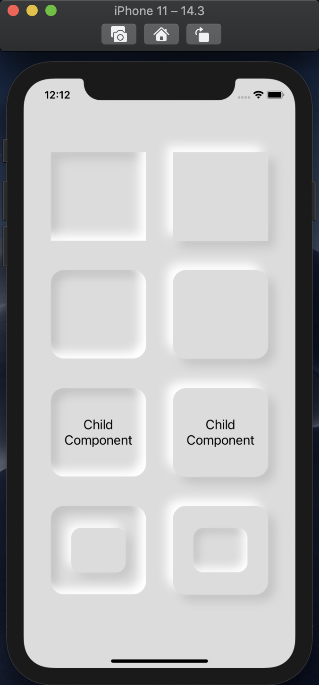

# shadows-rn

&nbsp;

## A Component For Easy Shadows In React Native

&nbsp;



&nbsp;

---

v2.2.0

## Features:

&nbsp;

Inset Shadows  
Outset Shadows  
Multiple Shadows  
Child Components  
Border Radius  
Transparent Background

&nbsp;

---

&nbsp;

## How To Use

&nbsp;

### Installation:

```
npm install shadows-rn
```

You should also install react, react-native, and **react-native-webview** if not already installed

```
react-native link
cd ios && pod install
```

### Import:

```
import Shadow from "shadows-rn"
```

### Basic Use:

```
<Shadow
    style = {
        {
            width: 200,
            height: 100,
            backgroundColor: "yellow"
        }
    }
    shadows = {
        [
            {
                offsetX: 10,
                offsetY: -5,
                radius: 5,
                color: "red"
            }
        ]
    }
    inset = {true}
>
    <Text>This is a child component</Text>
</Shadow>
```

&nbsp;

---

&nbsp;

## Documentation

&nbsp;

### Props:

-   style
-   shadows
-   inset

&nbsp;

### Style:

This is the styling of the container element for the shadow.
It can have all standard styles that a view could normally have, **except overflow**, which will be overruled to visible.
Any styles intended for the children of the shadow component **should be inside a container element inside the shadow component** for their styles to be applied.
For example, to align text inside a shadow component it would be done like this:

```
<Shadow style={/* Shadow Styles */} shadows={[/* Shadows */]} inset={/* Shadow Is Inset? */}>
    <View style={
        flex: 1,
        alignItems: "center",
        justifyContent: "center"
    }>
        <Text>Aligned Text</Text>
    </View>
</Shadow>
```

&nbsp;

### Shadows:

The shadows property is an array of objects that determine the position, radius, and color of a shadow.  
For each of the shadow objects, the component will render a shadow with the corresponding styles.

These objects are structured as

```
{
    offsetX: Number,
    offsetY: Number,
    radius: Number,
    color: String
}
```

If they are left unset or as the wrong type, they will automatically default and output a warning in the console.

### Inset:

A boolean stating whether the shadows are inset.  
In a shadow component, each rendered shadow will either be inset or outset.  
To mix inset and outset shadows, a shadow can be the child of another shadow.
